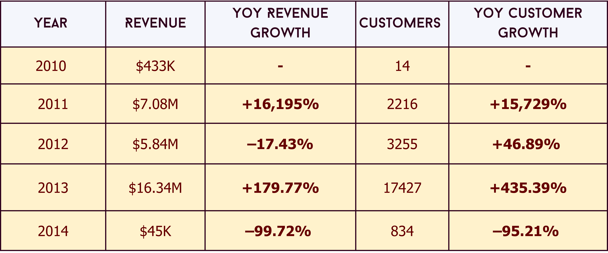
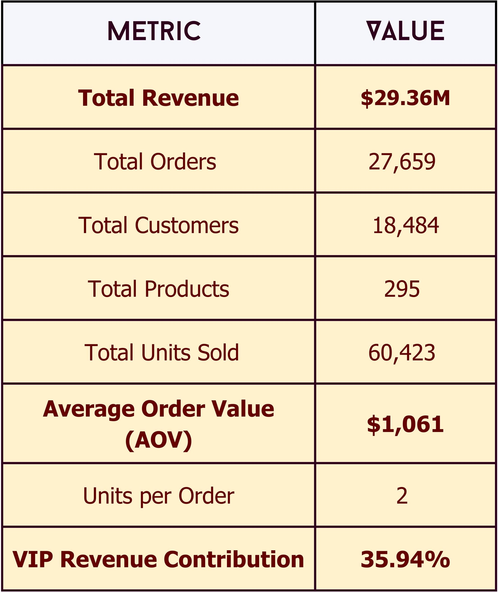

  

# 🚴 RideCraft Revenue, Product & Customer Analytics 

## 1. 📌 Project Overview

RideCraft is a US-based cycling products company operating across Bikes, Accessories, and Clothing categories.
This project analyzes transactional sales data from December 2010 to January 2014 to evaluate business performance across revenue growth, customer value, and product lifecycle dynamics.

The objective of this analysis is to move beyond descriptive reporting and answer business-critical questions such as:

What is driving revenue growth?

Which products and customers create disproportionate value?

How scalable is the current growth model?

Where should the business focus investment, optimization, or rationalization?

All analysis is performed entirely in SQL.

## 2. Datastructure Overview

  

## 3. Executive Summary

The analysis shows that RideCraft’s revenue is $29.36M which overwhelmingly driven by Bikes, and account for 96.46% of total sales, despite Accessories and Clothing contributing a much larger share of total order volume.

**📈 Revenue & Customer Growth Analysis (YoY)    🧭 Key Business KPIs** 

<table>
  <tr>
    <td align="left">
      
    </td>
    <td align="right">
      
    </td>
  </tr>
</table>

A major inflection point occurs in 2013, when the business enters a rapid growth phase characterized by:

  * Sharp growth in customer count
  * Faster growth in quantity sold than revenue
  * Increasing average basket size
  * Strong adoption of multi-item purchasing behavior

Customer segmentation reveals a classic value imbalance:

* Most customers are New Customers
* VIP customers represent a smaller group but contribute a disproportionate share of total revenue, particularly within premium bike categories

Strong seasonality patterns are observed, with consistent Q4 demand peaks across years.

## 4. Insights Deep Dive

### 📈 Time-Based Growth Analysis

  * 2011–2012: Growth is steady but largely transactional, with most customers placing small, single-item orders.
  * 2013: A clear behavioral shift occurs as customers begin purchasing multiple items per order, indicating successful cross-selling and bundling strategies.
  * January 2014 shows a sharp decline in sales due to partial data and is therefore excluded from year-over-year performance comparisons.

This progression reflects RideCraft’s transition from basic sales expansion to scalable, multi-product purchasing behavior

### 💰 Category Contribution to Sales

  *	Bikes: $28.3M (96.46% of total revenue)
  *	Accessories: $0.7M (2.39%)
  *	Clothing: $0.34M (1.16%)

**Bikes are the undisputed revenue backbone.**
With $28.3M in sales (96.46%), bikes—especially the Road-150 Red and Mountain-200 series—drive almost the entire business. 
These premium models consistently outperform accessories and apparel, confirming strong customer willingness to pay for high-quality core products.

**Accessories and Clothing play a strategic—not revenue—role.**  Despite contributing just ~3.5% of revenue combined, these categories:

  *	Increase order frequency
  *	Improve average basket size
  *	Act as key levers for cross-selling and upselling
  *	Support customer retention, especially among Regular and VIP customers

### 🏆 Product Performance Analysis

**🏆 Best Performing (2013)**

  * Road-150 Red series emerged as the top performer with $1M+ in sales, making it the highest revenue-generating product line.
  * Mountain-200 series followed closely in the $900K+ range, reinforcing strong performance of premium bike models.

Bikes significantly outperformed accessories and clothing, dominating overall sales contribution.

**📉 Worst Performing (2014)**

  * Accessories like Patch-Kit, Bike-Wash, Touring tire tube contribute least to the revenue.
  * In clothing category racing socks are below average performer.

### 🌍 Geographic Demand Patterns

**The data highlights a strong geographic imbalance in demand**, with the United States emerging as the most mature and diversified market. 
It leads not only in bike volumes but also in accessories and clothing, 
indicating a well-developed ecosystem where customers engage across multiple product categories rather than making single-purpose purchases. 

In contrast, **European markets (France, Germany, UK) and Canada show more selective buying behavior, particularly for bikes.**
Volumes are lower and skewed toward specific models (notably the Mountain-200 series), suggesting price sensitivity, preference for proven SKUs, or regional riding conditions influencing demand. 
These regions appear less diversified, signaling an opportunity—but also a risk—if inventory is not tightly aligned to local preferences.

A key stabilizing insight is the **consistent performance of universal accessories**, especially **water bottles and branded caps**, across nearly all regions. 
These products act as low-barrier entry points, supporting first-time purchases and serving as effective bundling tools alongside bikes, 
particularly in markets with cautious bike demand.

### 👥 Customer Segmentation Analysis

Customers were segmented based on spending behavior and relationship duration:

New Customers: 14,828

Regular Customers: 2,037

VIP Customers: 1,619

**Customer growth is acquisition-heavy.**
With 80% new customers (14,828), the business is clearly expanding its reach. However, this also implies high acquisition costs and relatively weak conversion into long-term relationships.

**Retention is narrow but powerful.**
Only 20% of customers (Regular + VIP) are retained, yet this small group likely contributes a disproportionate share of repeat revenue, especially the VIP segment (9%, 1,619 customers), which represents high lifetime value and stability.
Although the majority of customers are new, VIP customers are long-term, high-value contributors **~36% of total revenue**, likely driving a significant portion of bike revenue. 
This indicates strong potential for retention-focused growth strategies.

## 5. Recommendations

**🧮 Finance Team Recommendations**
Goal: Improve profitability, reduce risk, and optimize capital allocation

  * Mitigate revenue concentration risk by tracking dependency on Bikes (96.46%) and setting category-level risk thresholds.
  * Reallocate budgets toward high-margin bike SKUs (Mountain-200, Road-150) and away from consistently underperforming products (Touring, Mountain-500, low-priced apparel).

**📣 Marketing Team Recommendations**
Goal: Drive retention, improve basket size, and optimize acquisition costs

  * Shift focus from new customer acquisition (80%) to retention campaigns for Regular and VIP segments.
  * Design bundle-based promotions (Bike + Helmet + Water Bottle + Cap), especially in the U.S. market.
  * Use entry-level accessories (water bottles, caps) as low-cost acquisition hooks in Europe and Canada.

**🧑‍💼 Sales Team Recommendations**
Goal: Maximize revenue per customer and close high-value deals

  * Focus sales efforts on upselling accessories at bike purchase, not as standalone items.
  * Create VIP-only offers for high-value customers (early access, premium bundles).

**🎯 Product & Category Management Recommendations**
Goal: Optimize portfolio and improve product-market fit

* Rationalize SKUs by discontinuing or regionalizing underperformers.
* Focus R&D on premium bike improvements rather than expanding low-performing categories.
* Use consistent performers (helmets, water bottles, caps) as anchors in new launches.

**🏭 Plan for Seasonality**
* Align inventory, marketing, and promotions with strong Q4 demand.
* Use historical trends to forecast and prepare for peak sales periods.

